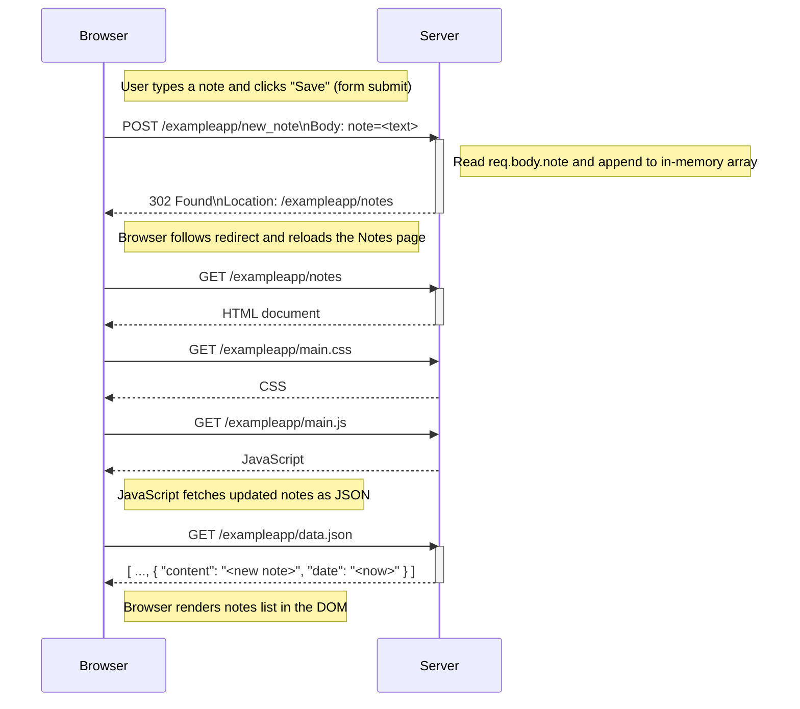

# 0.4 — New note (non‑SPA)

```mermaid
sequenceDiagram
    participant browser as Browser
    participant server as Server

    Note right of browser: User types a note and clicks "Save" (form submit)
    browser->>server: POST /exampleapp/new_note\nBody: note=<text>
    activate server
    Note right of server: Read req.body.note and append to in-memory array
    server-->>browser: 302 Found\nLocation: /exampleapp/notes
    deactivate server

    Note right of browser: Browser follows redirect and reloads the Notes page
    browser->>server: GET /exampleapp/notes
    activate server
    server-->>browser: HTML document
    deactivate server

    browser->>server: GET /exampleapp/main.css
    server-->>browser: CSS

    browser->>server: GET /exampleapp/main.js
    server-->>browser: JavaScript

    Note right of browser: JavaScript fetches updated notes as JSON
    browser->>server: GET /exampleapp/data.json
    activate server
    server-->>browser: [ ..., { "content": "<new note>", "date": "<now>" } ]
    deactivate server

    Note right of browser: Browser renders notes list in the DOM
```
