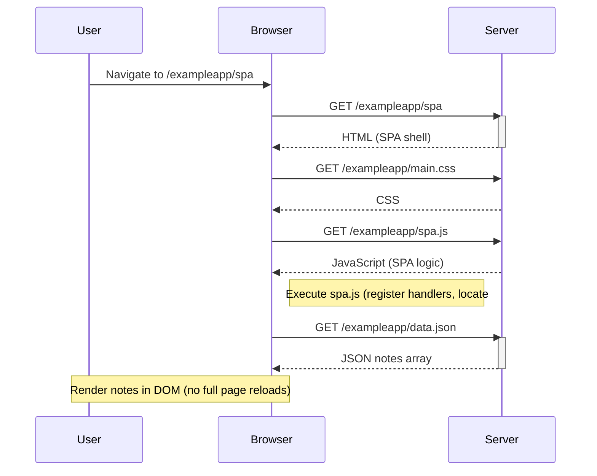

# 0.5 — Single-page app (SPA) initial load

```mermaid
sequenceDiagram
    participant U as User
    participant B as Browser
    participant S as Server

    U->>B: Navigate to /exampleapp/spa
    B->>S: GET /exampleapp/spa
    activate S
    S-->>B: HTML (SPA shell)
    deactivate S

    B->>S: GET /exampleapp/main.css
    S-->>B: CSS

    B->>S: GET /exampleapp/spa.js
    S-->>B: JavaScript (SPA logic)

    Note right of B: Execute spa.js (register handlers, locate #notes_form, trigger initial fetch)

    B->>S: GET /exampleapp/data.json
    activate S
    S-->>B: JSON notes array
    deactivate S

    Note over B,U: Render notes in DOM (no full page reloads)
```
