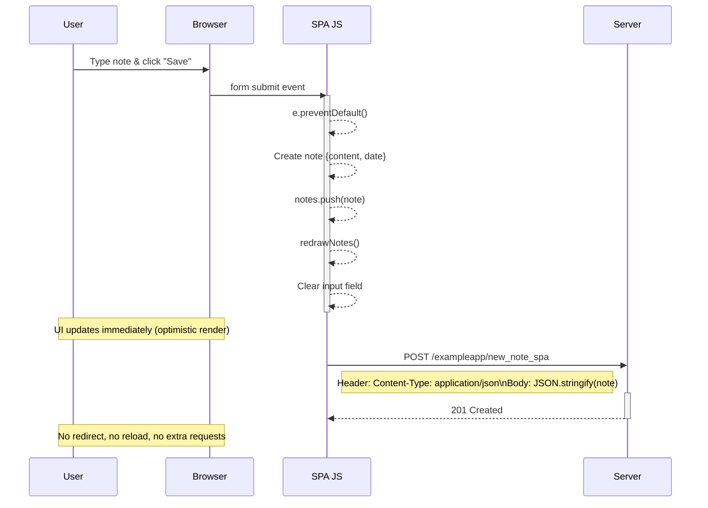

# 0.6 — New note in the SPA

```mermaid
sequenceDiagram
    participant U as User
    participant B as Browser
    participant A as SPA JS
    participant S as Server

    U->>B: Type note & click "Save"
    B->>A: form submit event
    activate A
    A-->>A: e.preventDefault()
    A-->>A: Create note {content, date}
    A-->>A: notes.push(note)
    A-->>A: redrawNotes()
    A-->>A: Clear input field
    deactivate A

    Note over B,U: UI updates immediately (optimistic render)

    A->>S: POST /exampleapp/new_note_spa
    Note right of A: Header: Content-Type: application/json\nBody: JSON.stringify(note)
    activate S
    S-->>A: 201 Created
    deactivate S

    Note over B,U: No redirect, no reload, no extra requests
```
