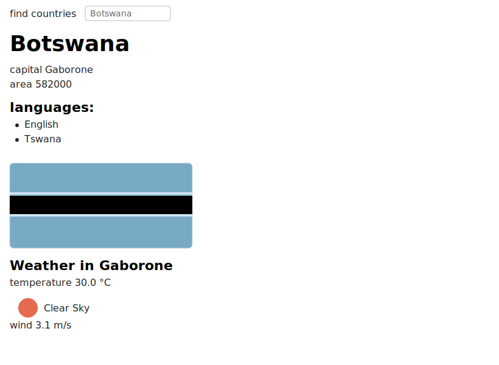

# Data for Countries (Full Stack Open, Part 2)

A small React app for searching countries using the University of Helsinki Rest Countries API and viewing details for a selected country including live weather from OpenWeather.

## Demo Screenshot

## Getting Started

1. Install dependencies
   - `npm install`
2. Create an environment file with your OpenWeather API key (required for the weather panel)
   - Create `.env.local` in the project root with:
     - `VITE_OPENWEATHER_API_KEY=your_api_key_here`
   - Restart the dev server after adding or changing env vars.
3. Run the app
   - `npm run dev`

## Features

- Filter countries by name (case-insensitive)
- If > 10 matches, asks to refine the filter
- If 2–10 matches, lists country names with a Show button
- If exactly 1 match, shows basic info, languages, flag, and current weather

## Notes

- Env files are ignored by Git via `.gitignore` so your API key is not committed.
- Weather data requires a valid and active OpenWeather API key; new keys can take some minutes to activate.
